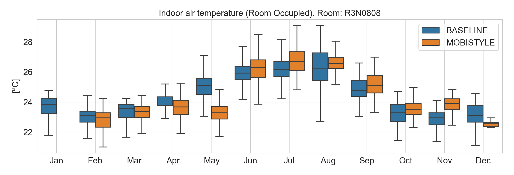
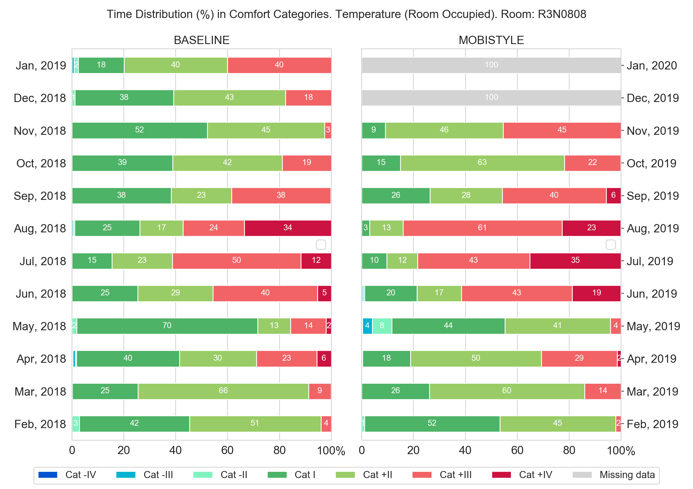
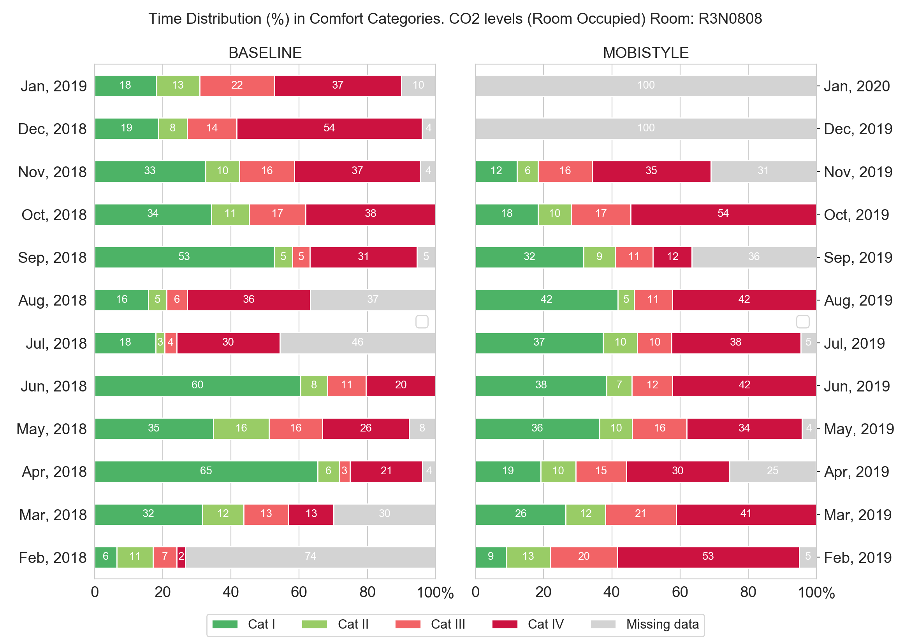
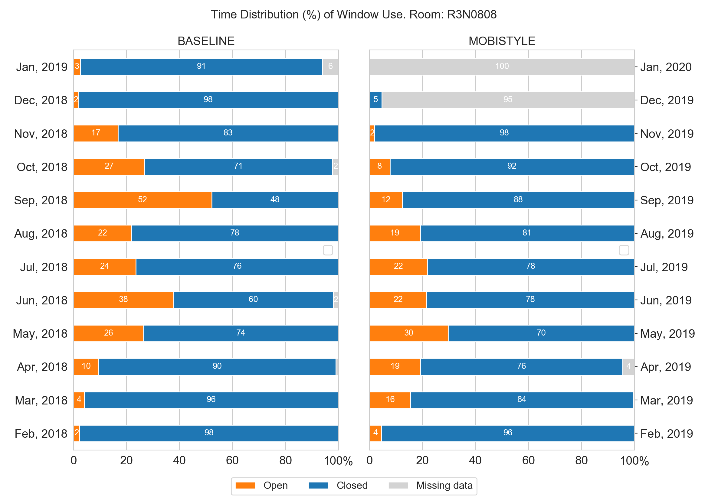
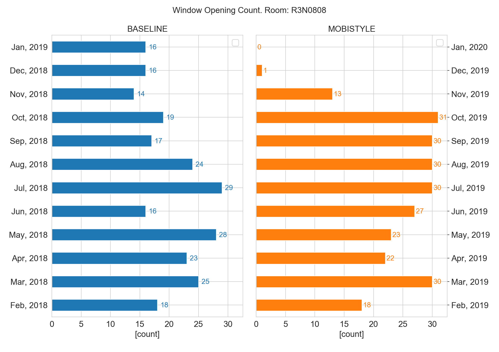
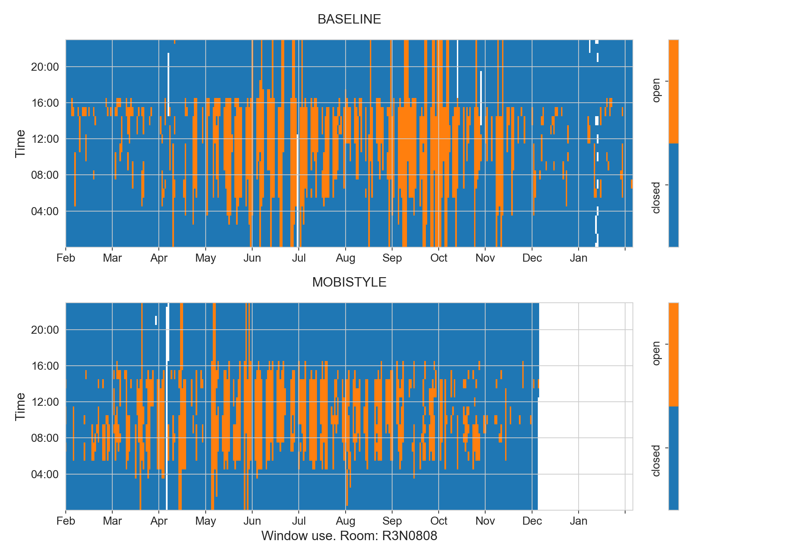
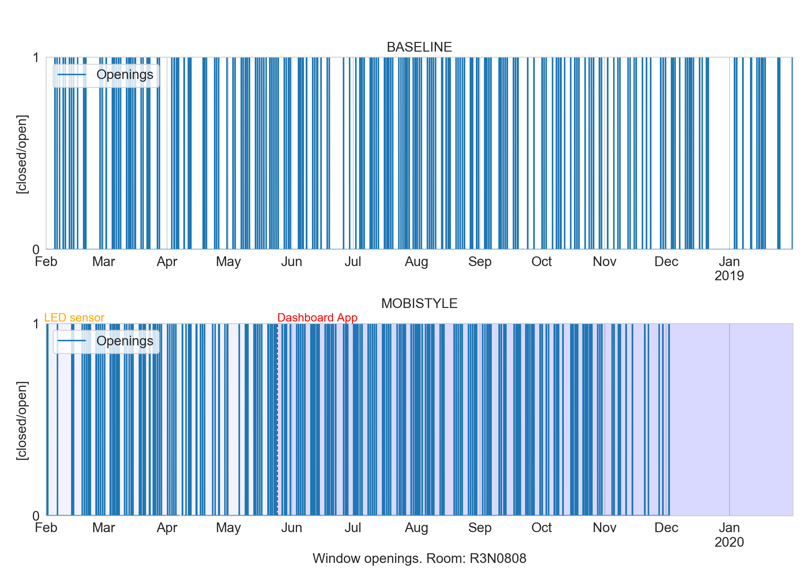
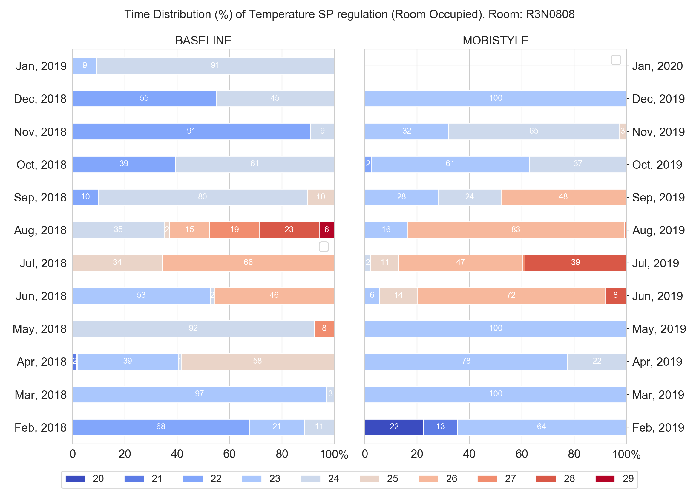
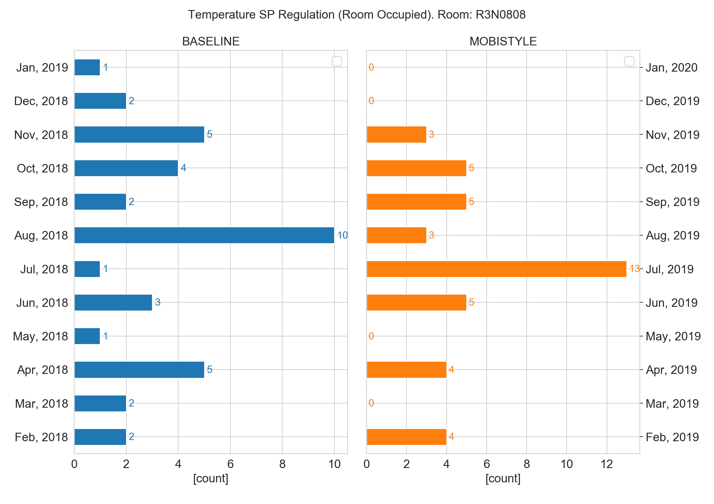
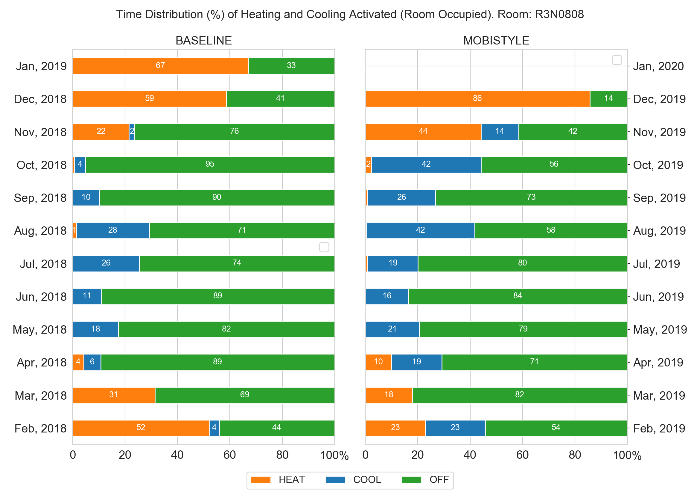

.. _R3N0808:

Room R3N0808
============

Temperature
-----------

See table :ref:`Comfort categories <comfort-categories>` for the various category limits for heating and cooling seasons.

   :download:`PNG DOWNLOAD <../../Results/Figures/R3N0808/boxplot_monthly_temp_R3N0808.png>` 

   :download:`PNG DOWNLOAD  <../../Results/Figures/R3N0808/comf_temp_R3N0808.png>`

CO2 concentration levels
------------------------

See table :ref:`Comfort categories <comfort-categories>` for the Indoor Air Quality (IAQ) category limits.

.. image:: ../../Results/Figures/R3N0808/boxplot_monthly_co2_R3N0808.png

User behavior
-------------

Room use
~~~~~~~~
.. image:: ../../Results/Figures/R3N0808/time_occ_R3N0808.png

Window openings
~~~~~~~~~~~~~~~

Room Temperature Setpoint Regulation
~~~~~~~~~~~~~~~~~~~~~~~~~~~~~~~~~~~~

Heating and Cooling
~~~~~~~~~~~~~~~~~~~

